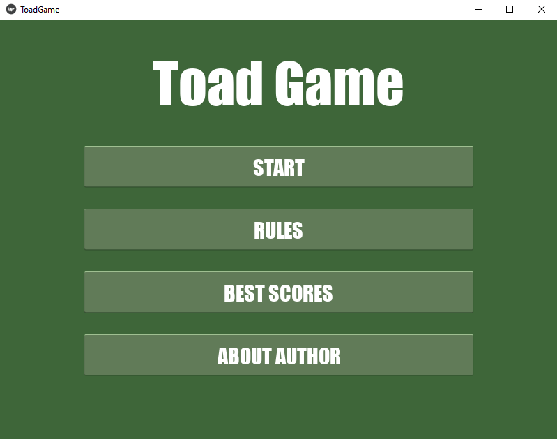
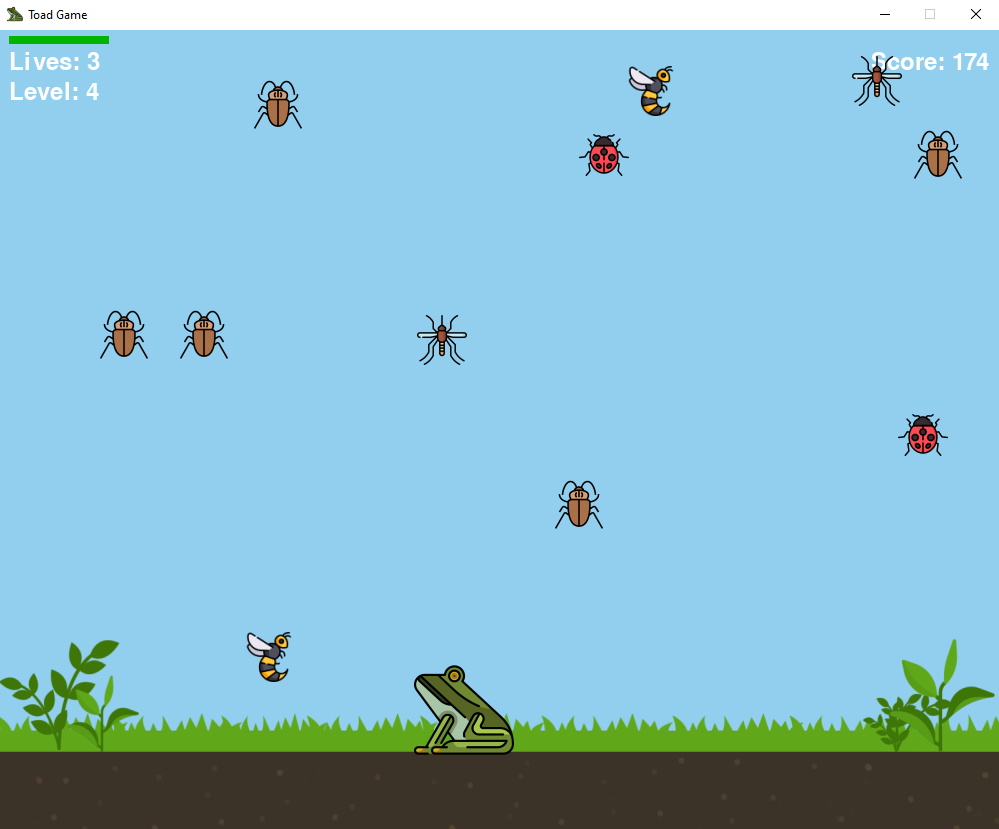

# ToadGame
### Author:
Dominika Sachanbińska

### Short description:
A simple arcade-styled python game based on pygame module.
Move the toad to eat all the edible creatures that fly/fall/crawl your way and avoid the harmful ones. Set new highest scores, but be careful - the difficulty progresses! 




### Technologies:
- Python - the game is written in python programming language
- Pygame - python module used for all game mechanics
- Kivy - python module used for GUI

### How to run this app?

1. Clone the ToadGame repository replacing 'my-folder' with the directory you want to store ToadGame in: 
<br>```git clone https://github.com/DomAnnS/ToadGame my-folder```
<br>```cd my-folder```

2. Install the project's development and runtime requirements: 
<br>```pip install -r requirements.txt```

3. Run ```ToadGame.py``` file from the console or in code editor.
